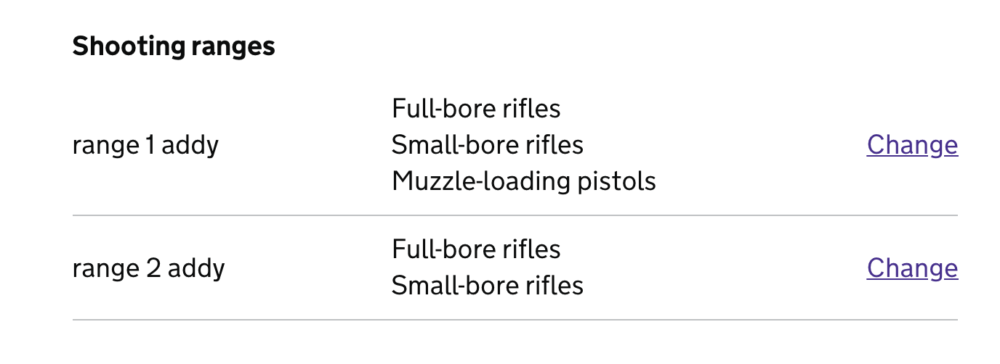

# HOF (Home Office Forms)

[](https://github.com/UKHomeOfficeForms/hof/actions)
[](https://badge.fury.io/js/hof)
[](https://snyk.io/test/npm/hof)

HOF (Home Office Forms) is a framework designed to assist developers in creating form-based workflows in a rapid, repeatable and secure way. It aims to reduce simple applications as much as possible to being configuration-only.

## Server Settings

In your `hof.settings.json` file you can add `getTerms: false` and `getCookies: false` to turn off the default cookies, and terms and conditions information provided by the HOF framework. This is if you want to provide more specific material at the service level in regards to these subject matter otherwise the defaults should suffice.

Also you can set `getAccessibility: true` to get the default accessibility document for this framework if one is not provided at the service level. It is assumed there should have been an accessibility audit carried out for a service already hence why the default setting for this is set to `false`. But if a generic placeholder is needed to ensure the service is legally compliant then this can be set to `true` to provide the default one presented within the framework.

## Resources

### HOF documentation

[https://ukhomeofficeforms.github.io/hof-guide/](https://ukhomeofficeforms.github.io/hof-guide/)

## Content Security Policy

### Inline JavaScript from 18.0.0

From version 18.0.0, unsafe-inline has been removed from the content security policy by default. This means scripts
must either be referenced using the src attribute, `<script src='...'></script>` or with a nonce value attribute. A nonce
value is generated for every request. You can add this to your own templates' inline scripts as needed:

```
<script {{#nonce}}nonce="{{nonce}}"{{/nonce}}>
...
</script>
```

### Built with HOF

- https://github.com/UKHomeOffice/gro
- https://github.com/UKHomeOffice/end-tenancy
- [Firearms Licensing (Home Office)](https://github.com/UKHomeOffice/firearms)
- [Contact UK Trade & Investment (UK Trade & Investment)](https://github.com/UKTradeInvestment/contact-ukti)
- [Biometric Residence Permit (Home Office)](https://github.com/UKHomeOffice/brp_app)
- [Report terrorist material (Home Office)](https://github.com/UKHomeOffice/rotm)
- [UKVI Complaints (Home Office)](https://github.com/UKHomeOffice/Complaints)

## HOF BUILD

Performs build workflow for hof apps in prod and development

## Usage

Run a build by running `hof-build` from the command line in your project directory.

```
hof-build [task]
```

If no task is specified then all tasks will run.

It is recommended to alias `hof-build` to an npm script in your package.json.

## Tasks

- `browserify` - compiles client-side js with browserify
- `sass` - compiles sass
- `images` - copies images from ./assets/images directory to ./public/images
- `translate` - compiles translation files

Note: For SASS compilation it's possible to additionally configure the following options via the hof.settings file (see the configuration section below)
- `outputStyle` - Controls whether the CSS output is compressed or not, expanded (default) = non compressed and compressed = compressed CSS output.
- `quietDeps` - This controls whether you get deprecation warning shown in the console output, if set to false (default) SASS deprecation warnings will be shown in the console, if set to true then deprecation warnings will not be shown in the console output.

## Watch

You can additionally run a `watch` task to start a server instance, which will automatically restart based on changes to files. This will also re-perform the tasks above when relevant files change.

By default files inside `node_modules` directories and dotfiles will not trigger a restart. If you want to include these files then you can set `--watch-node-modules` and `--watch-dotfiles` flags respectively.

### Local environment variables

You can load local environment variables from a file by passing an `--env` flag to `hof-build watch` and creating a `.env` file in your project root that defines your local variables as follows:

```
MY_LOCAL_ENVVAR=foo
MY_OTHER_ENVVAR=bar
```

_Note: `export` is not required, and values should not be quoted._

To load variables from a file other than `.env` you should pass the location of the file as a value on the `--env` flag.

```
hof-build watch --env .envdev
```

## Configuration

The default settings will match those for an app generated using [`hof-generator`](https://npmjs.com/hof-generator).

If a `hof.settings.json` file is found in the application root, then the `build` section of the settings file will be used to override [the default configuration](./defaults.js).

Alternatively you can define a path to a local config file by passing a `--config` option

```
hof-build --config /path/to/my/config.js
```

Any task can be disabled by setting its configuration to `false` (or any falsy value).

```js
module.exports = {
  browserify: false,
};
```

### Configuration options

Each task has a common configuration format with the following options:

- `src` - defines the input file or files for the build task
- `out` - defines the output location of the built code where relevant
- `match` - defines the pattern for files to watch to trigger a rebuild of this task
- `restart` - defines if this task should result in a server restart

Additionally the server instance created by `watch` can be configured by setting `server` config. Available options are:

- `cmd` - defines the command used to start the server
- `extensions` - defines the file extensions which will be watched to trigger a restart

### Shared Translations

By default translations put in the commons directory in a HOF project, i.e. `app/common/translations/src`, are bundles together and shared with other translation files of the same name, e.g. fields.json, buttons.json etc. Any other files will have their own json file created in the default.json translation file of a sub application. E.g. in `app/<sub_app>/translations/en/default.json`.

To override this behaviour you can add the following to your `hof.settings.json` file or to the settings possible to hof on your server.js file

Hof.settings.json example

```
"build": {
  "translate": {
    "shared": "./apps/another_common_directory/translations/src"
  }
}
```

server.js example

```
const hof = require('hof');
const settings = { ...behaviours, ...routes };

settings.build = { translate: { shared: "./apps/another_common_directory/translations/src" } };

const app = hof(settings);
```

## HOF TRANSPILER

Home office forms transpiler is a tiny tool that can be used as part of a build or manually to convert multipart locales files into one default.json. This is used in our stack for translations of form applications.

## Usage

```
hof-transpiler [source dir|glob] {OPTIONS}

       --shared, -s  A path or glob to a directory of shared translations
```

## Example

Lets say you have a directory such as: `translations/src/en`

Which contains:

```
buttons.json
emails.json
errors.json
validation.json
```

If you run hof-transpiler against the directory `hof-transpiler ./translations/src`

It will iterate through src and for each directory it will create a new directory at the root level with a built default.json file `translations/en/default.json`

Which will look something like

```
{
  "buttons": {
    json blob from buttons.json
  },
  "emails": {
    json blob from emails.json
  },
  "errors": {
    json blob from errors.json
  },
  "validation": {
    json blob from validation.json
  }
}
```

This is used further down the hof stack for application translations.

## Advanced example - duplicate keys between source folder and shared folder

Lets say you have a directory such as: `translations/src/en`

Which contains:
buttons.json containing:

```json
{
  "unusual-button": "Moo"
}
```

emails.json containing:

```json
{
  "customer-email": "Hi how are you?"
}
```

And you also have a directory of shared translations such as: `shared-translations/src/en`

Which contains:
buttons.json containing:

```json
{
  "common-button": "Click me"
}
```

If you then run:

```bash
hof-transpiler translations/src --shared shared-translations/src
```

Then transpiled translations should appear in translations/en/default.json as follows:

```json
{
  "buttons": {
    "unusual-button": "Moo",
    "common-button": "Click me"
  },
  "emails": {
    "customer-email": "Hi how are you?"
  }
}
```

Note how a deep merge is performed between the json, with key value pairs from "buttons" being included from both files.

## Multiple shared sources

hof-transpiler supports multiple shared sources, extending them from left to right. This is useful if you have translations shared between applications, and additional shared translations between routes within an application.

If you have the following sources:

node_modules/hof-template-partials/translations/src/en/buttons.json

```json
{
  "continue": "Continue",
  "skip": "Skip",
  "submit": "Submit",
  "abort": "Abort"
}
```

common/translations/src/en/buttons.json

```json
{
  "skip": "Skip this step",
  "cancel": "Cancel"
}
```

my-application/translations/src/en/buttons.json

```json
{
  "continue": "Go Forth!"
}
```

If you then run:

```bash
hof-transpiler my-application/translations/src --shared node_modules/hof-template-partials/translations/src --shared common/translations/src
```

my-application/translations/en/default.json

```json
{
  "buttons": {
    "continue": "Go Forth!",
    "skip": "Skip this step",
    "submit": "Submit",
    "abort": "Abort",
    "cancel": "Cancel"
  }
}
```

#HOF Controller

Implements a request pipeline for GET and POST of forms, with input cleaning/formatting and validation.

## Usage

Basic usage:

```javascript
var Form = require("./controller");

var form = new Form({
  template: "form",
  fields: {
    name: {
      validate: "required",
    },
  },
});

app.use("/", form.requestHandler());
```

This won't really be very useful though, since all it will do is render the "form" template on `/` and respond to GET and POST requests.

For real-world usage you will probably want to extend the Form class to create your own controllers.

```javascript
var Form = require('./controller''),
    util = require('util');

var MyForm = function (options) {
    Form.call(this, options);
};

util.inherits(MyForm, Form);

module.exports = MyForm;
```

The Form class allows for a number of insertion points for extended functionality:

- `configure` Allows for dynamic overwriting of particular points of form configuration based on user session
- `process` Allows for custom formatting and processing of input prior to validation
- `validate` Allows for custom input validation
- `getValues` To define what values the fields are populated with on GET
- `saveValues` To define what is done with successful form submissions

All of these methods take three arguments of the request, the response and a callback. In all cases the callback should be called with a first argument representing an error.

- `getErrors/setErrors` Define how errors are persisted between the POST and subsequent GET of a form step.
- `locals` Define what additional variables a controller exposes to its template

These methods are synchronous and take only the request and response obejct as arguments.

### Validators

The library [supports a number of validators](https://github.com/UKHomeOffice/passports-form-controller/blob/master/lib/validation/validators.js).

By default the application of a validator is optional on empty strings. If you need to ensure a field is validated as being 9 characters long and exists then you need to use both an `exactlength` and a `required` validator.

#### Custom Validators

Custom validator functions can be passed in field config. These must be named functions and the name is used as the error.type for looking up validation error messages.

fields.js

```js
{
    'field-1': {
        validate: ['required', function isTrue(val) {
            return val === true;
        }]
    }
}
```

### steps config

#### Handles journey forking

Each step definition accepts a `next` property, the value of which is the next route in the journey. By default, when the form is successfully submitted, the next steps will load. However, there are times when it is necessary to fork from the current journey based on a users response to certain questions in a form. For such circumstances there exists the `forks` property.

In this example, when the submits the form, if the field called 'example-radio' has the value 'superman', the page at '/fork-page' will load, otherwise '/next-page' will be loaded.

```js

'/my-page': {
    next: '/next-page',
    forks: [{
        target: '/fork-page',
        condition: {
            field: 'example-radio',
            value: 'superman'
        }
    }]
}
```

The condition property can also take a function. In the following example, if the field called 'name' is more than 30 characters in length, the page at '/fork-page' will be loaded.

```js

'/my-page': {
    next: '/next-page',
    forks: [{
        target: '/fork-page',
        condition: function (req, res) {
            return req.form.values['name'].length > 30;
        }
    }]
}
```

Forks is an array and therefore each fork is interrogated in order from top to bottom. The last fork whose condition is met will assign its target to the next page variable.

In this example, if the last condition resolves to true - even if the others also resolve to true - then the page at '/fork-page-three' will be loaded. The last condition to be met is always the fork used to determine the next step.

```js

'/my-page': {
    next: '/next-page',
    forks: [{
        target: '/fork-page-one',
        condition: function (req, res) {
            return req.form.values['name'].length > 30;
        }
    }, {
        target: '/fork-page-two',
        condition: {
            field: 'example-radio',
            value: 'superman'
        }
    }, {
        target: '/fork-page-three',
        condition: function (req, res) {
            return typeof req.form.values['email'] === 'undefined';
        }
    }]
}
```

### Dynamic field options

If the options for a particular field are dependent on aspects of the user session, then these can be extended on a per-session basis using the `configure` method.

For example, for a dynamic address selection component:

```js
MyForm.prototype.configure = function configure(req, res, next) {
  req.form.options.fields["address-select"].options =
    req.sessionModel.get("addresses");
  next();
};
```

### The FormError class

FormError can be used as a façade to normalise different types of error one may receive / trigger, and to be subsequently returned from a controller.
Its constructor takes a series of options. `title` and `message` have both getters and public methods to define default values.

```js
let error = new ErrorClass(this.missingDoB, {
  key: this.missingDob,
  type: "required",
  redirect: "/missingData",
  title: "Something went wrong",
  message: "Please supply a valid date of birth",
});
```

##hof-behaviour-session

HOF Behaviour for reading and writing to the session

##Usage

###With [mixwith.js](https://github.com/justinfagnani/mixwith.js)

```js
const mix = require('mixwith').mix;
const Session = require('./controller/behaviour-session');
const BaseController = require('./controller');

class MyController extends mix(BaseController).with(Session) {
  ...
}
```

`MyController` now extends `hof-form-controller` and has `hof-behaviour-session` functionality mixed in.

##Functionality

This mixin extends `hof-form-controller` by persisting the form data to the `sessionModel` - assuming the [session-model](https://github.com/UKHomeOfficeForms/hof-form-wizard/blob/master/lib/middleware/session-model.js) middleware has been applied.

The following form controller methods are used:

- `getValues(req, res, cb)` - calls callback with `null` and a map of all items in the `sessionModel`, extended with `errorValues` - to persist entered values on current step if validation fails
- `saveValues(req, res, cb)` - Called on success. Sets all step fields in `req.form.values` to the sessionModel, unsets `errorValues`.
- `getErrors(req)` - returns all errors for fields on the current step (`req.form.options.fields`), excluding redirects. Set to `req.form.errors` in `hof-form-controller`.
- `setErrors(err, req)` - called on validation error(s). Sets the current step field values as `errorValues` in sessionModel to be used in `getValues`. Sets `errors` to sessionModel - a map of `field-name: error` to be used in `getErrors`.
- `locals(req, res)` - Extends the result of `super.locals` with `baseUrl` (`req.baseUrl`) and `nextPage` (the result of `this.getNextStep(req, res)`).
- `missingPrereqHandler(req, res)` - Error handler called when a `MISSING_PREREQ` error is thrown from the [check-progress](https://github.com/UKHomeOfficeForms/hof-form-wizard/blob/master/lib/middleware/check-progress.js) middleware. This occurs if a step is visited out of sequence. This error handler causes the user to be redirected to the last completed step, or the first step if none have been completed.
- `errorHandler(err, req, res, next)` - checks if `err.code` is `MISSING_PREREQ`, if so calls `missingPrereqHandler`, if not calls `super` to hand over to parent error handler.

##behaviour-hooks

HOF Behaviour enabling lifecycle hooks for extending functionality in main form pipeline.

##Usage

###With [mixwith.js](https://github.com/justinfagnani/mixwith.js)

```js
const mix = require('mixwith').mix;
const Hooks = require('./controller/behaviour-hooks');
const BaseController = require('./controller');

class MyController extends mix(BaseController).with(Hooks) {
  ...
}
```

`MyController` now extends `hof-form-controller` and has `hof-behaviour-hooks` functionality mixed in.

##Functionality

The following hooks are currently supported, the methods are GET/POST pipeline methods from `hof-form-controller`:

####GET

- `_getErrors` - `'pre-getErrors', 'post-getErrors'`
- `_getValues` - `'pre-getValues', 'post-getValues'`
- `_locals` - `'pre-locals', 'post-locals'`
- `render` - `'pre-render', 'post-render'`

####POST

- `_process` - `'pre-process', 'post-process'`
- `_validate` - `'pre-validate', 'post-validate'`
- `saveValues` - `'pre-saveValues', 'post-saveValues'`
- `successHandler` - `'pre-successHandler', 'post-successHandler'`

###In field config

fields.js

```js
module.exports = {
  "field-1": {
    hooks: {
      "post-locals": (req, res, next) => {
        Object.assign(res.locals, {
          foo: "bar",
        });
        next();
      },
      "pre-process": (req, res, next) => {
        req.body["field-1"] = req.body["field-1"].toUpperCase();
        next();
      },
    },
  },
};
```

# HOF Model

Simple model for interacting with http/rest apis.

## Usage

```javascript
const Model = require("./model");
```

## Data Storage

Models can be used as basic data storage with set/get and change events.

### Methods

#### `set`

Save a property to a model. Properties can be passed as a separate key/value arguments, or with multiple properties as an object.

```javascript
const model = new Model();
model.set("key", "value");
model.set({
  firstname: "John",
  lastname: "Smith",
});
```

#### `get`

Retrieve a property from a model:

```javascript
const val = model.get("key");
// val = 'value'
```

#### `toJSON`

Returns a map of all properties on a model:

```javascript
const json = model.toJSON();
// json = { key: 'value' }
```

### Events

`change` is emitted when a property on a model changes

```javascript
const model = new Model();
model.on("change", (changedFields) => {
  // changedFields contains a map of the key/value pairs which have changed
  console.log(changedFields);
});
```

`change:<key>` is emitted when a particular property - with a key of `<key>` - on a model changes

```javascript
const model = new Model();
model.on("change:name", (newValue, oldValue) => {
  // handler is passed the new value and the old value as arguents
});
model.set("name", "John Smith");
```

### Referenced Fields

A field can be set to a reference to another field by setting it a value of `$ref:<key>` where `<key>` is the field to be reference. The field will then behave exactly like a normal field except that its value will always appear as the value of the referenced field.

```javascript
const model = new Model();
model.set("home-address", "1 Main Street");
model.set("contact-address", "$ref:home-address");

model.get("contact-address"); // => '1 Main Street';
model.set("home-address", "2 Main Street");
model.get("contact-address"); // => '2 Main Street';

model.toJSON(); // => { home-address: '2 Main Street', 'contact-address': '2 Main Street' }
```

Change events will be fired on the referenced field if the underlying value changes.

```javascript
const model = new Model();
model.set("home-address", "1 Main Street");
model.set("contact-address", "$ref:home-address");
model.on("change:contact-address", (value, oldValue) => {
  // this is fired when home-address property changes
});

model.set("home-address", "2 Main Street");
```

A field can be unreferenced by setting its value to any other value.

```javascript
const model = new Model();
model.set("home-address", "1 Main Street");

// reference the field
model.set("contact-address", "$ref:home-address");

// unreference the field
model.set("contact-address", "1 Other Road");
```

## API Client

Normally this would be used as an abstract class and extended with your own implementation.

Implementations would normally define at least a `url` method to define the target of API calls.

There are three methods for API interaction corresponding to GET, POST, and DELETE http methods. These methods all return a Promise.

### Methods

#### `fetch`

```javascript
const model = new Model();
model.fetch().then((data) => {
  console.log(data);
});
```

#### `save`

```javascript
const model = new Model();
model.set({
  property: "properties are sent as JSON request body by default",
});
model.save().then((data) => {
  console.log(data);
});
```

The method can also be overwritten by passing options

```javascript
const model = new Model();
model.set({
  property: "this will be sent as a PUT request",
});
model.save({ method: "PUT" }).then((data) => {
  console.log(data);
});
```

#### `delete`

```javascript
const model = new Model();
model.delete().then((data) => {
  console.log(data);
});
```

### Options

If no `url` method is defined then the model will use the options parameter and [Node's url.format method](https://nodejs.org/api/url.html#url_url_format_urlobj) to construct a URL.

```javascript
const model = new Model();

// make a GET request to http://example.com:3000/foo/bar
model
  .fetch({
    protocol: "http",
    hostname: "example.com",
    port: 3000,
    path: "/foo/bar",
  })
  .then((data) => {
    console.log(data);
  });
```

### Events

API requests will emit events as part of their lifecycle.

`sync` is emitted when an API request is sent

```javascript
model.on("sync", function (settings) {});
```

`success` is emitted when an API request successfully completes

```javascript
model.on("success", function (data, settings, statusCode, responseTime) {});
```

`fail` is emitted when an API request fails

```javascript
model.on("fail", function (err, data, settings, statusCode, responseTime) {});
```

### HOF Model APIs

- `Html-To-Pdf Converter`: This extends the HOF model to interact with the html-to-pdf converter API https://github.com/UKHomeOffice/html-pdf-converter. The environmental variable `PDF_CONVERTER_URL` needs to be set to its local url when running in the same kube namespace to the service that wants to use it. This is then followed by the default port `10443` and then the URI for which part of the service you want to consume. For example:`https://html-pdf-converter:10443/convert` when the container is named `html-pdf-converter` in your kube deployment file. This has to be set to `https` for communication between services to work on ACP. However, `settings.rejectUnauthorized = false;` is set in the model to circumvent expired certificates due to this. This is preferable to using:

```
name: NODE_TLS_REJECT_UNAUTHORIZED
value: "0"
```

which should NOT be used as it sets ignoring TLS at a global level which could present a MITM (Man-In-The-Middle) attack.

Usage: Example below, as per the converter docs (link above) it accepts html and responds with Buffered data in pdf format which can then be either written to a file or attached to a Gov Notify message:

```
const PDFModel = require('hof').apis.pdfConverter;

const pdfModel = new PDFModel();
pdfModel.set({ template: html });
const pdfData = await pdfModel.save();
```

# HOF Middleware

A collection of commonly used HOF middleware, exports `cookies`, `notFound`, and `errors` on `middleware`

## Arranging the middleware in your app

Cookies middleware should be placed before any other routes, this guarantees that any data gathered in the form will be saved to the session.
The Not Found middleware should be placed after all routes and before the Error handler middleware. This arrangement ensures that if an error is thrown it will be caught.

## Cookies

### Usage

```js
app.use(
  require("hof").middleware.cookies({
    "cookie-name": "my-application-cookie",
    "param-name": "my-query-param",
  })
);
```

This middleware must be declared before your other routes.

### Options

The `cookie-name` can be the same as your session cookie. (The
middleware will not overwrite it.) Defaults to `hof-cookie-check`.

The `param-name` should be chosen so that it does not clash with names
you are using elsewhere. In almost all cases the default value of
`hof-cookie-check` will suffice.

The error raised when cookies are not supported by the client can then
be handled in you error handler by identifying it using its `code`
property which will be set to `NO_COOKIES`.

You can also provide an array of healthcheck URLs with `healthcheckUrls`,
should you not want to throw a Cookies required error when requesting the app with specific URLs.
Kubernetes healthcheck URLs are provided as defaults if no overrides are supplied.

## Not found (404)

Expects there to be a view called 404 in your configured `/views` directory

### Usage

```js
app.use(
  require("hof").middleware.notFound({
    logger: require("/logger"),
    translate: require("hof").i18n({
      path: path_to_translations / __lng__ / __ns__.json,
    }).translate,
  })
);
```

This middleware should be declared _after_ your other routes but _before_ your errorhandler.

### Options

`logger` can be any object with a warn method.

`translate` can be the HOF i18n translate function

## Errors

### Usage

```js
app.use(
  require("hof").middleware.errors({
    logger: require("/logger"),
    translate: require("hof").i18n({
      path: path_to_translations / __lng__ / __ns__.json,
    }).translate,
    debug: true,
  })
);
```

This middleware must be declared _after_ your other routes.

### Options

`logger` can be any object with an error method.

`translate` can be the HOF i18n translate function

`debug` set to true will present the stack trace in the form and return the err as the content of the template.

# **Note** If `debug === true` translations will not be served, but the error handler default messages

## Deep translate

deepTranslate middleware supports nested conditional translations in order to show different content in different scenarios. The middleware adds a `translate` function to `req` which is used in various points throughout the architecture. This middleware must be applied before any other middleware which rely on the `req.translate` function. Also when initializing the form wizard, or template mixins, if a `translate` function is provided, this will be used rather than the deepTranslate middleware.

### Usage

```js
const i18nFuture = require("hof").i18n;
const i18n = i18nFuture({
  path: path.resolve(__dirname, "./path/to/translations"),
});
app.use(
  require("hof").middleware.deepTranslate({
    translate: i18n.translate.bind(i18n),
  })
);
```

locales

```json
"fields": {
    "field-name": {
        "label": {
            "dependent-field": {
                "value-1": {
                    "dependent-field-2": {
                        "value-1": "Label 1",
                        "value-2": "Label 2"
                    }
                },
                "value-2": "Label 3"
            },
            "default": "Fallback label"
        }
    }
}
```

Using the translation key `fields.field-name.label` will return different values in different situations depending on the values of named fields. In the above example the following are true:

- If both `dependent-field` and `dependent-field-2` have the value `"value-1"`, the label returned will be `"Label 1"`.
- If the value of `dependent-field` is `"value-1"` and the value of `dependent-field-2` is `"value-2"`, the label returned will be `"Label 2"`.
- If the value of `dependent-field` is `"value-2"` the label returned will be `"Label 3"` regardless of the value of `dependent-field-2`
- The default label `"Fallback label"` will be used if value of `dependent-field` is neither of the given options, or it is `undefined`. It will also be used if the value of `dependent-field` is `"value-1"` and the value of `dependent-field-2` is neither of the given options or it is undefined.

# HOF Components

## Date Component

A component for handling the rendering and processing of 3-input date fields used in HOF Applications.

### Usage

In your fields config:

```js
const dateComponent = require("hof").components.date;

module.exports = {
  "date-field": dateComponent("date-field", {
    validate: ["required", "before"],
  }),
};
```

The above example will create a new date component with the key `'date-field'` and will apply the validators `required` and `before` (before today).

### Configuration

The following optional configuration options are supported:

- `validate {String|Array}` - validators to use on the processed date field
- `template` - an absolute path to an alternate template.
- `dayOptional {Boolean}` - day defaults to `01` if omitted. Defaults to `false`
- `monthOptional {Boolean}` - month defaults to `01` if omitted. If true then also forces `dayOptional` to be true. Defaults to `false`

### Labels

The three intermedate fields have fallback labels of Day, Month and Year, however custom labels can be used by including the translation at the following path:

fields.json

```json
{
  "field-name": {
    "parts": {
      "day": {
        "label": "Custom Day Label"
      },
      "month": {
        "label": "Custom Month Label"
      },
      "year": {
        "label": "Custom Year Label"
      }
    }
  }
}
```

## Summary Page Component

HOF behaviour for showing summary pages

The behaviour mixin will create a set of "locals" data which is compatible with [the `confirm` view from `hof-template-partials`](https://github.com/UKHomeOfficeForms/hof-template-partials/blob/master/views/confirm.html).

### Usage

If no sections config is passed, then the mixin will create a section for each step that has fields, and a row within each section for each field on that step.

```js
'/confirm': {
  behaviours: require('hof').components.summary,
  ...
}
```

Alternatively, sections can be defined manually as follows:

```js
'/confirm': {
  behaviours: require('hof').components.summary,
  sections: {
    'museum-details': [
      'name',
      {
        field: 'exhibit-addresses',
        parse: (value) => value.map(a => a.address),
        step: '/exhibit-add-another-address'
      }
    ],
    'contact': [
      'contact-name',
      'contact-email',
      'contact-phone',
      {
        field: 'contact-address',
        step: '/contact-address'
      }
    ]
  },
  ...
}
```

### Configuration

The `sections` configuration should be a map of arrays, where the entries in the array are the fields that should be shown within that section.

#### Field configuration

Fields can be defined as simple strings of the field key, in which case all default configuration will be used.

Alternatively, a field can be passed as an object with a `field` property defining the field key, and any additional properties as follows:

- `step` - `String` defines the step which the user is returned to to edit the field value. By default this is the first step in the form's steps configuration which contains the field.
- `parse` - `Function` can parse the value for the field from the session into a value for display.
- `derivation` - `Object` allows for a new derived field based on a combination of other fields in the form. Note that
  if both `derivation` and `parse` are specified then parse will be applied to the result of derivation. E.G.
  ```javascript
     derivation: {
       fromFields: ['field-one', 'field-two'],
       combiner: (values) => values.map(it => Number(it)).reduce((a, b) => a + b, 0)
     }
  ```
- `useOriginalValue` - `Object` uses original value of radio button or checkbox label rather than trying to find a translation in the `fields.json` file. This could be due to options that are generated by user input that can not be predicted in advance, which are subsequently used to populate a value in the summary page. One good example is using one of many addresses inputted by a user that is additionally a contact address. See example below:
  

- `multipleRowsFromAggregate` - `Object` if this object exists on a field, it uses the `labelCategory`, `valueCategory` and `valueTranslation` values to populate the row's label and value name but also iterates over multiple rows that have been aggregated under one field name. There is one good reference of this in Firearms where the following example is used:

```javascript
{
  field: 'location-addresses',
  step: '/location-add-another-address',
  multipleRowsFromAggregate: {
    labelCategory: 'address',
    valueCategory: 'address-category',
    // Optional: uses valueCategory name if not specified
    valueTranslation: 'location-address-category'
  }
}
```

The `location-addresses` field is one that the application has setup to aggregate and store all addresses labelled with the `address` field. Each address is a storage location for firearms, and so there is a sub-category which lists what firearms type is listed under each address (i.e. Full-bore, small-bore, muzzle-loading), and these are stored under the `address-category` field. Along with translations to them in the `fields.json` file living under the `location-address-category` translation header. By utilising these three values one can achieve the following output on the summary page.



This allows the creation of summary rows based on unknown dynamic user input, i.e. we can not predict in advance how many addresses a user wants to input, what the addresses are and how many categories the user wants to attach to each address. This allows you to easily list them this way.

### Translations

The content for section headings and field labels will be loaded from translation files based on the keys.

#### Section headings

Translations for section headings are looked for in the following order:

- `pages.confirm.sections.${key}.header`
- `pages.${key}.header`

#### Field labels

Translations for field labels are looked for in the following order:

- `pages.confirm.fields.${key}.label`
- `fields.${key}.label`
- `fields.${key}.legend`

## Emailer Component

HOF behaviour to send emails

### Usage

```js
const EmailBehaviour = require('hof').components.emailer;

// configure email behaviour
const emailer = EmailBehaviour({
  transport: 'ses',
  transportOptions: {
    accessKeyId: '...',
    secretAccessKey: '...'
  },
  template: path.resolve(__dirname, './views/emails/confirm.html'),
  from: 'confirmation@homeoffice.gov.uk',
  recipient: 'customer-email',
  subject: 'Application Successful'
});

// in steps config
steps: {
  ...
  '/confirm': {
    behaviours: ['complete', emailer],
    next: '/confirmation',
    ...
  },
  ...
}
```

### Options

In addition to the options passed to `hof-emailer`, the following options can be used:

- `recipient` - _Required_ - defines the address to which email will be sent. This can be set either as a key to retrieve an email address from the session, or explicitly to an email address.
- `template` - _Required_ - defines the mustache template used to render the email content.
- `subject` - defines the subject line of the email.
- `parse` - parses the session model into an object used to populate the template.

`recipient` and `subject` options can also be defined as functions, which will be passed a copy of the session model and a translation function as arguments, and should return a string value.

```js
// use a translated value for the email subject line
const emailer = EmailBehaviour({
  // ...
  subject: (model, translate) => translate("email.success.subject"),
});
```

## HOF Emailer

An emailer service for HOF applications.

### Installation

```bash
$ npm install hof-emailer --save
```

### Usage

```js
// first create an emailer instance
const Emailer = require("hof").components.email.emailer;
const emailer = new Emailer({
  from: "sender@example.com",
  transport: "smtp",
  transportOptions: {
    host: "my.smtp.host",
    port: 25,
  },
});

// then you can use your emailer to send emails
const to = "recipient@example.com";
const body = "This is the email body";
const subject = "Important email!";
emailer.send(to, body, subject).then(() => {
  console.log(`Email sent to ${to}!`);
});
```

### Options

- `from`: <String>: Address to send emails from. Required.
- `transport`: <String>: Select what mechanism to use to send emails. Defaults: 'smtp'.
- `transportOptions`: <Object>: Set the options for the chosen transport, as defined below. Required.
- `layout`: <String>: Optional path to use a custom layout for email content.

### Transports

The following transport options are available:

#### `smtp`

[nodemailer-smtp-transport](https://github.com/andris9/nodemailer-smtp-transport)

##### Options

- `host` <String>: Address of the mailserver. Required.
- `port` <String|Number>: Port of the mailserver. Required.
- `ignoreTLS` <Boolean>: Defaults to false.
- `secure` <Boolean>: Defaults to true.
- `auth.user` <String>: Mailserver authorisation username.
- `auth.pass` <String>: Mailserver authorisation password.

#### `ses`

[nodemailer-ses-transport](https://github.com/andris9/nodemailer-ses-transport)

##### Options

- `accessKeyId` <String>: AWS accessKeyId. Required.
- `secretAccessKey` <String>: AWS accessKeyId. Required.
- `sessionToken` <String>
- `region` <String>. Defaults to 'eu-west-1'.
- `httpOptions` <String>
- `rateLimit` <String>
- `maxConnections` <String>

#### `debug`

A development option to write the html content of the email to a file for inspection.

`transport: 'debug'`

##### debug options

- `dir` <String>: The location to save html to. Default: `./.emails`. This directory will be created if it does not exist.
- `open` <Boolean>: If set to true, will automatically open the created html file in a browser.

##### debug example

```
transport: 'debug'
transportOptions: {
  dir: './emails',
  open: true
}
```

#### `stub`

Disables sending email. No options are required.

## Session Timeout Warning Component
HOF component for customising session timeout related pages
This feature allows you to customise the content related to the session timeout warning, including the messages displayed in the session timeout warning dialog and on the exit page after a user exits the form due to a session timeout.

### Usage

To enable and customize the session timeout behavior, you need to set the component in your project's `hof.settings.json` file:
```js
 "behaviours": [
    "hof/components/session-timeout-warning"
  ]
```

By default, the framework uses the standard content provided by HOF. If you wish to override this with custom content at the project level, you must set the following variables to `true` in `hof.settings.json`:

```js
 behaviours: [
    require('../').components.sessionTimeoutWarning
  ],
  sessionTimeoutWarningContent: true,
  exitFormContent: true
```

### Customising content in `pages.json`
Once the variables are set, you can customize the session timeout warning and exit messages in your project's pages.json: 

```json
"exit": {
  "message": "We have cleared your information to keep it secure. Your information has not been saved."
},
"session-timeout-warning": {
   "dialog-title": "Your application will close soon",
   "dialog-text": "If that happens, your progress will not be saved.",
   "timeout-continue-button": "Stay on this page",
   "dialog-exit-link": "Exit this form"
}
```

### Editing content on the Exit Page Header and Title
To edit the exit page's header and title, create an `exit.json` file in your project and set the desired content:
```json
{
  "header": "You have left this form",
  "title": "You have left this form"
}
```

# UTILITIES

# Autofill Utility

A webdriverio plugin to automate filling a form

## Usage

First, add the command to your webdriverio client:

```js
const webdriver = require("webdriverio");
const client = webdriver.remote(options);

client.addCommand("goto", require("hof-util-autofill")(client));
```

The command can be given any name you like, here we've called it `goto`.

Then you can use the command as normal as part of your webdriver command chain.

```js
it("completes a form to a certain step automatically", () => {
  return browser
    .goto("/confirm")
    .getUrl()
    .then((url) => {
      assert.ok(url.indexOf("/confirm") > -1);
    });
});

it("uses any data passed as a second argument to fill out the form", () => {
  const inputs = { "first-name": "David", "last-name": "Hasselhoff" };
  return browser
    .goto("/confirm", inputs)
    .$("span.full-name")
    .getText()
    .then((name) => {
      assert.equal(name, "David HasselHoff");
    });
});

it("saves screenshots of errors to specified screenshot location", () => {
  const inputs = {};
  return browser.goto("/confirm", inputs, {
    screenshots: "/path/to/output/dir",
  });
});

it("tries a pre-specified number of times to get past stuck loops", () => {
  const inputs = {};
  return browser.goto("/confirm", inputs, { maxLoops: 1 });
});
```

## Options

Options are passed as a third argument to the exposed method. The following options are available:

- `maxLoops` - determines how many times a step will retry if it resolves back to itself on submission before failing. Default: `3`
- `screenshots` - specifies a location to save screenshots of the page when it gets stuck. If not specified then no screenshots are saved.

# Test-Data Utility

Generator for test fixtures

## Usage

The library contains a number of generators for values of certain types. Values are generators on accessing the type property.

### Example:

```js
const TestData = require("hof").utils.testData;

console.log(TestData.name);
// "David Fletcher"

console.log(TestData.name);
// "Irene O'Grady"
```

## Available generators

- `firstname`
- `lastname`
- `name`
- `email`
- `phone`
- `streetname`
- `streetsuffix`
- `address` - `${number(1,100)} ${streetname} ${streetsuffix}`
- `postcode`
- `country` - a random country from [homeoffice-countries](npmjs.com/homeoffice-countries)

## Functions

- `number(min, max)` - returns an integer between `min` and `max`
- `number(max)` - returns an integer between 0 and `max`
- `number()` - returns an integer between 0 and 100

# Countries Utility

A utility to parse `homeoffice-countries` into a usable format for hof select elements

By default hof select elements expect a list of options as an objet with `value` and `label` properties. If passed an array of strings as options it will attempt to translate the strings with some field-specific keys attached.

## Usage

In field configuration:

```js
{
  country: {
    mixin: 'select',
    validate: 'required',
    options: require('hof').utils.countries()
  }
}
```

## Options

If needed, the following options can be passed into the countries function:

- `filter` - `Function` - applies a filter to the list of country names before mapping them
- `parse` - `Function` - applies a transform to the country name before setting the label

## i18n

If you wish to translate the countries into outher languages, you may want the labels to be in the form of translation keys. In this case you can use a `parse` option to convert the country names into a translation key:

```js
const countries = require("hof").utils.countries;
const options = countries({
  parse: (country) => `countries.${country.toLowerCase().split(" ").join("-")}`,
});
```

You can then define a single translation for country names to be used for all country list instances.

# FRONTEND

## Template Mixins

A middleware that exposes a series of Mustache mixins on `res.locals` to ease usage of forms, translations, and some other things.

## Installation

```javascript
npm install [--save] hof-template-mixins;
```

## Usage

```javascript
var express = require("express");

var i18n = require("i18n-future");
var mixins = require("hof").frontend.mixins;

app.set("view engine", "html");
app.set("views", path.join(__dirname, "/views"));

app.use(i18n.middleware());
app.use(mixins());

app.use(function (req, res) {
  // NOTE: res.locals.partials has been set.
  res.render("example-template");
});
```

If rendering as part of a hof controller's middleware chain then the field configuration will automatically be set to `res.locals.options.fields` by the controller, and will be loaded from here by the mixins.

Alternatively, if not using hof controllers, you can explicitly set field configuration with instantiating the middleware by passing a `fields` option. This should not be used for dynamic field configuration.

## Translation

By default any function set to `req.translate` will be used for translation if it exists. For example, that generated using [i18n-future](https://npmjs.com/package/i18n-future) middleware.

## Options

### viewsDirectory

Allows you override the directory that the module checks for partials in - Default: the root of this project

### viewEngine

Allows you to alter the file extension of the templates - Default: 'html'

### sharedTranslationsKey

Prefixes keys for translation - Default: ''

### translate

Defines a custom translation method - Default: `req.translate`

### fields

Allows for manually setting static field configuration - Default: null

## Mustache mixins available

```
t
time
selected
lowercase
uppercase
hyphenate
date
currency
select
input-text
input-date
input-text-compound
input-text-code
input-number
input-phone
radio-group
checkbox
checkbox-compound
checkbox-required
checkbox-group
input-submit
textarea
qs
renderField
```

### qs

This mixin takes a `key=value` query string and returns a query string with the extra params appended. If the key is already present in the query string, the value passed to the mixin is used

```html
<a href="{{#qs}}key=value{{/qs}}">Click to append query</a>
```

### renderField

The renderField mixin can be called in your template to render all fields. This will lookup the field.mixin in res.locals and call it passing the field key.

```html
{{#fields}} {{#renderField}}{{/renderField}} {{/fields}}
```

fields.js

```js
module.exports = {
  "my-field": {
    mixin: "input-text",
  },
};
```

If mixin is omitted `input-text` will be used

To disable auto-rendering of a field, set `disableRender: true` in the field config. This is required when using the `child` element rendering functionality to prevent the field being rendered multiple times.

### Render a single field

To render a specific fields in your templates use the mixin name (matching those above) and field name like so...

```html
{{#input-text}}myTextField{{/input-text}} {{#select}}mySelectMenu{{/select}}
{{#radio-group}}myRadioGroup{{/radio-group}}
```

## Options

- `className`: A string or array of string class names.
- `label`: The intended value of the HTML `label` attribute.
- `type`: The value of the HTML input `type` attribute.
- `required`: Value applied to `aria-required` HTML attribute.
- `hint`: This adds context to the label, which it is a part of, for input text, radio groups and textarea. It is used within the input by aria-describedby for screen readers.
- `maxlength`: Applicable to text-based fields and mapped to the `maxlength` HTML attribute.
- `maxword`: Applicable to textarea fields.
- `options`: Applicable to HTML `select` and `radio` controls and used to generate the items of either HTML element.
- `selected`: Applicable to `select`, `checkbox`, and `radio` controls. Will render the selected HTML option/element selected or checked.
- `legend`: Applicable to `radio` button controls, which are wrapped in a HTML `fieldset` with a `legend` element.
- `legendClassName`: Applied as a class name to HTML `legend` attribute.
- `toggle`: Can be used to toggle the display of the HTML element with a matching `id`. See [hof-frontend-toolkit](https://github.com/UKHomeOfficeForms/hof-frontend-toolkit/blob/master/assets/javascript/progressive-reveal.js) for details.
- `attributes`: A hash of key/value pairs applicable to a HTML `textarea` field. Each key/value is assigned as an attribute of the `textarea`. For example `spellcheck="true"`.
- `child`: Render a child partial beneath each option in an `optionGroup`. Accepts a custom mustache template string, a custom partial in the format `partials/{your-partial-name}`, `'html'` which is used to specify the html for the field has already been prerendered, such as in [hof-component-date](https://github.com/UKHomeOfficeForms/hof-component-date) or a template mixin key which will be rendered within a panel element partial.
- `isPageHeading`: Applicable to `checkbox` and `radio`, `text input` and `textarea` controls. Sets the legend as the page heading on single page questions.
- `isWarning`: Applicable to `checkbox` and `radio` controls. Allows warning text to be placed after page headings on single page questions if required.

# HOF-template-partials

Home Office Forms template partials is a collection of mustache partials commonly used in HOF applications. It also contains a collection of i18n translations used within the template partials. All contents are designed to be extended in your individual applications.

## Usage

### Template partials

#### Standalone

Template partials can be used by adding the route to the views directory to your express application views setting. You will need to be using the HTML view engine with Hogan and Mustache.

```js
var app = require("express")();

app.set("view engine", "html");
app.set("views", [
  // your application shared views
  path.resolve(__dirname, "./path/to/views"),
  // the module exports paths to views and translations directories
  require("hof").frontend.partials.views,
]);
```

The views are now available when calling `res.render('view-name')` from express.

#### HOF Application

When used in a hof application in conjunction with [express-partial-templates](https://github.com/UKHomeOffice/express-partial-templates) the contents of the views directory are added to `res.locals.partials`. These are added right to left so conflicting views are resolved from the left-most directory.

```js
var app = require("express")();

app.set("view engine", "html");
app.set("views", [
  path.resolve(__dirname, "./path/to/views"),
  require("hof").frontend.partials.views,
]);
app.use(require("express-partial-templates")(app));

app.use(function (req, res, next) {
  // res.locals.partials contains all views from the views dir in this repo
  // which are extended by any local views in ./path/to/views
  next();
});
```

### Translations

The provided translations are designed to be used in conjunction with a translations library such as [i18n-future](https://github.com/lennym/i18n-future).

The exported `resources` method will return a compiled object containing the translations, which can be passed to an `i18n` instance as a pre-compiled resource.

```js
const translate = require("i18n-future").middleware({
  resources: require("hof").frontend.partials.resources(),
});
app.use(translate);
```

By default the namespace for this translation is `default`. A custom namespace can be specified by passing it as an argument to the `resources` function.

```js
const translate = require("i18n-future").middleware({
  resources: require("hof").frontend.partials.resources("hof-common"),
  fallbackNamespace: "hof-common",
});
app.use(translate);
```

### Cookie Banner

The cookie banner has a placeholder named serviceName that you can set within the locals of your hof application so that the appropriate value is displayed.

Set `appName` if your hof settings being passed to hof to take advantage of this.

# HOF FRONTEND THEME

## Usage

If you are using `hof-build` to build assets then you can add the following to your applications sass file.

```
@import "$$theme";
```

Otherwise add:

```
@import "hof/frontend/themes/gov-uk/styles/govuk";
```

## Configuration

By default the compiled sass will attempt to load referenced images from `/public/images`. To override this, add the following to the top of your sass file (noting trailing slash):

```
$path: "/path/to/your/images/";
```

# HOF FRONTEND GOVUK-TEMPLATE

Compiles govuk mustache template into a more usable format and provide middleware for use in apps.

Existing [govuk mustache template](https://www.npmjs.com/package/govuk_template_mustache) has simple mustache placeholders for content sections, which necessitates a two step compile process where sections are compiled individually and then again into the parent template.

Compiling the template to replace these placeholders with variables allows for templates to implement the govuk template as a parent partial.

## Example

```
{{< govuk-template}}

    {{$main}}
        <h1>Page Content</h1>
    {{/main}}

{{/ govuk-template}}
```

## Usage

When used as part of an express app, a middleware is returned which will add a static fileserver (using [serve-static](https://www.npmjs.com/package/serve-static)) to serve the template assets without needing to copy them to any other location.

It will also add the template as a mustache partial with a name of "govuk-template".

### To configure express middleware

```
app.use(require('hof').frontend.govUKTemplate([options]);
```

### To use the mustache partial

```
{{< govuk-template}}
    {{$pageTitle}}An example page{{/pageTitle}}
    {{$main}}
        <h1>Page Content</h1>
    {{/main}}
{{/ govuk-template}}
```

## Options

A number of options can be passed with the app into the setup method:

- `path` - Sets the base path for the location of static assets - Default: `/govuk-assets`

Other options are passed onto the [serve-static](https://www.npmjs.com/package/serve-static) configuration, and more details can be found in [the serve-static documentation](https://www.npmjs.com/package/serve-static)

# Nonce values

Version 18.0.0 and above of HOF provides and requires a nonce value for all inline javascript, as unsafe-inline is disabled.
Older versions (pre 18.0.0) will work with the hof-govuk-template templates as expected as the nonce value fields will only be added
if a nonce value is provided by the version of HOF.

## Example

There is an example implementation in [demo application](https://github.com/UKHomeOffice/home-office-forms-demo).

## Sandbox

There is a sandbox application for developers to test components directly in hof called [sandbox](/sandbox)

# HOF FRONTEND TOOLKIT

Set of common UI patterns/styles for HOF projects

## Images

Copy `assets/images/hmpo` to your image directory. Images are loaded by using the `file-url` function provided by [GOV.UK frontend toolkit](https://github.com/alphagov/govuk_frontend_toolkit). The `file-url` function uses the `$path` variable which is set before the toolkit's modules are loaded.

## Vendor JavaScript

Additional vendor JavaScript files are included. These are:

- details.polyfill.js
- indexof.polyfill.js
- safari-cachebuster.js

Copy `assets/javascript/vendor` into your javascript directory (ie `hmpo/vendor`) and compile them with your JavaScript.

## Journey Header Navigation.html page

- Navigation.html contains a journeyHeaderURL, which is set in the controller. 
- getJourneyHeaderURL within the controller translates an empty baseURL to '/'.
- The above helps fix broken journey header URLs in the GRO and UKVIC services which both have a baseURL's set to '/'.
